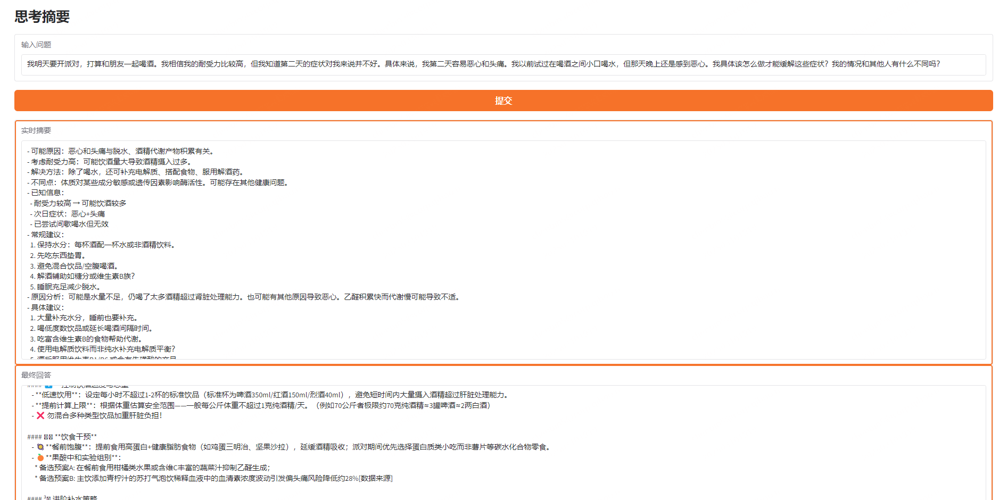

# Think Summary

With the advancement of large reasoning models (LRM), this project adopts a strategy similar to OpenAI's O1 approach, where the thought process is not displayed, and only a summarized conclusion is provided. An example illustration is shown below:

